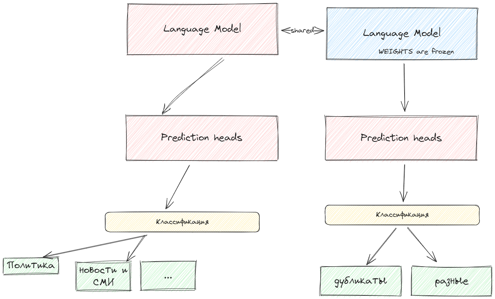

# thebatnews

## How we trained our model

First of all, we labeled some small subset using chat-gpt. Then, given the labeled data, we found that <a href="https://huggingface.co/intfloat/multilingual-e5-base">xlm-roberta</a> pretrained on semantic tasks performs the best.

Our approach is two stage fine-tuning. First of all, we tuned the model with prediction head on classification tasks using <a href="https://arxiv.org/abs/1708.02002">focal loss</a>. In the second stage we froze the language model and fine tuned only the next head (similariy head) to perform the duplicate detection (paraphrase). The overall workflow is below:




## Installation (docker)
* Download weights at [https://disk.yandex.ru/d/bfolkQ1elhoS0Q](https://disk.yandex.ru/d/bfolkQ1elhoS0Q)
* Put weights under `./thebatnews/weights/` folder

* Run with Docker
```sh
docker-compose up -d
```

## Installation (local)

Or

* Run locally
```sh
pip install -r requirements.txt
make run
```